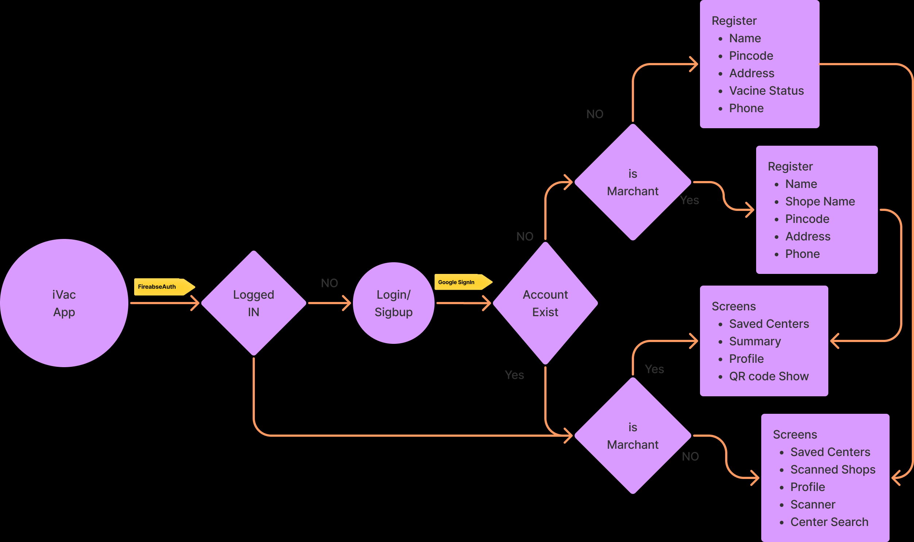

# iVac  

This app can show the vaccine status of all available centers across India and  QR code scanner in this application where shopkeepers have an app that shows QR code and users can scan this QR code which will automatically add that user to the visitor list. This should replace the manual entry of contact details in the shop due to COVID.

**Team Id:  *BFH/rec9nr5EDzC40zzKI/2021***

**Team Members**

**Joel Sunny Varghese**

**Akshay A**

**Aswaghosh**

---

### [iVac APK](https://drive.google.com/drive/folders/17L5zwg6oyelfa6iF8doxZJeuWYln9s6f?usp=sharing)

## Features 📲

- Search vaccine centers with districts and Pincode
- Save center to get availability notification
- Shops can able to generate QR code
- Users can scan QR code
- Shops can see visit summary
- Users can also see their logs
- Signup with google social auth
- Able to get notification

## Used Stacks 💻

- Flutter
- Node JS
- Firebase

## Basic work flow



**Todo:** Fix bugs

## Flutter App

### Create a firebase project and add google service.json file in:

[Flutter firebase docs](https://firebase.flutter.dev/docs/overview)

```jsx
iVac-App/android/app/
```

### Add firebase Realtime database URL

```jsx
iVac-App/lib/utils/service.dart
```

## Node App

### Configure firebase credentials

[Firebase Admin SDK](https://firebase.google.com/docs/admin/setup/)

Add and rename file in following format

```markdown
Notifier/service_key.json
```

### Add Firebase RDb URLs

```jsx
Notifier/notifier.js  -->line 10
```

### Add Firebase config snippet for Web app:

Setup Guide

```markdown
Notifier/app.js  -->line 8
```
